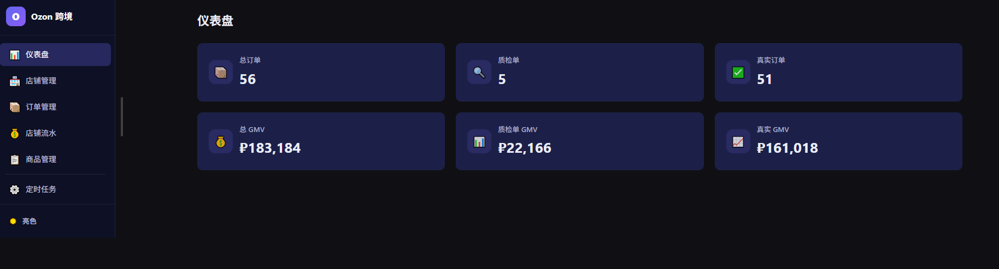
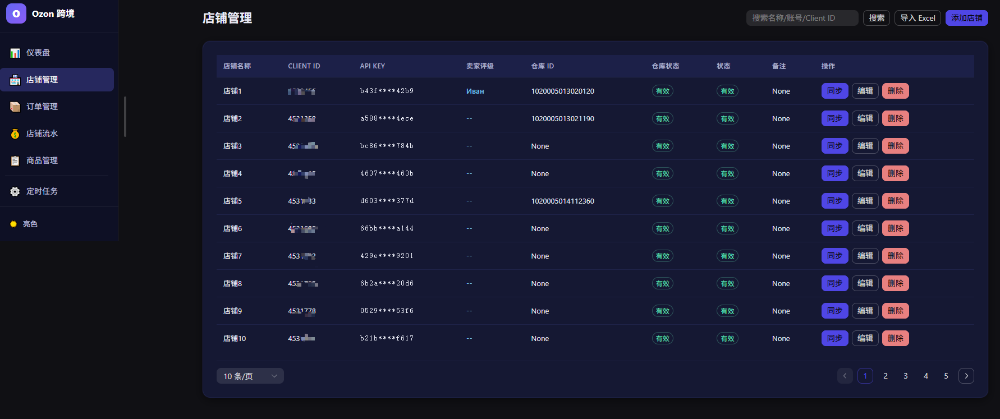
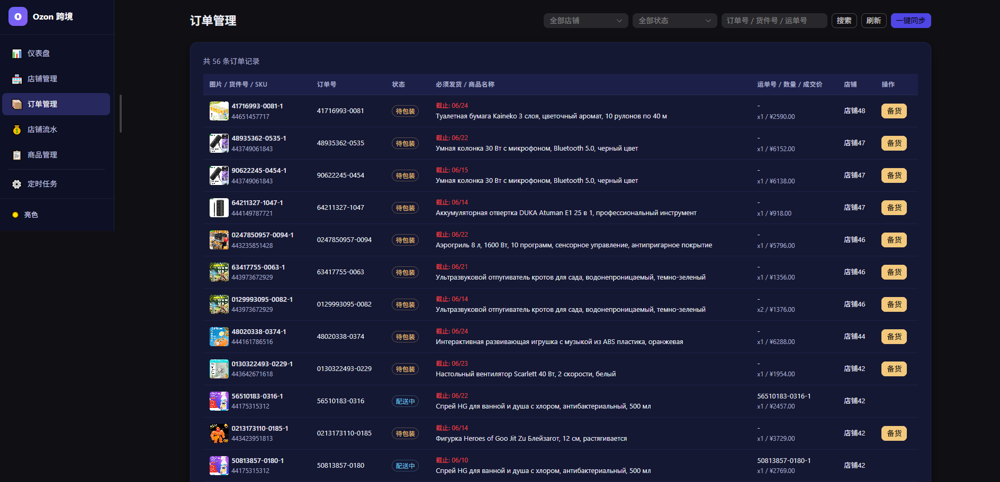
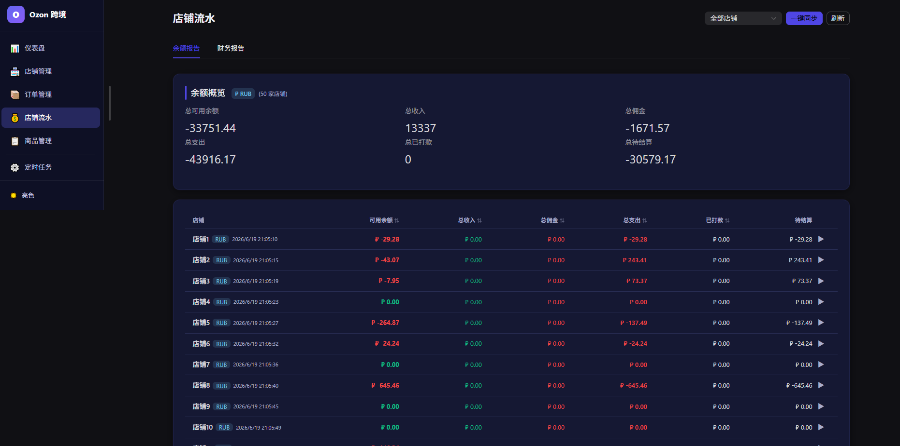
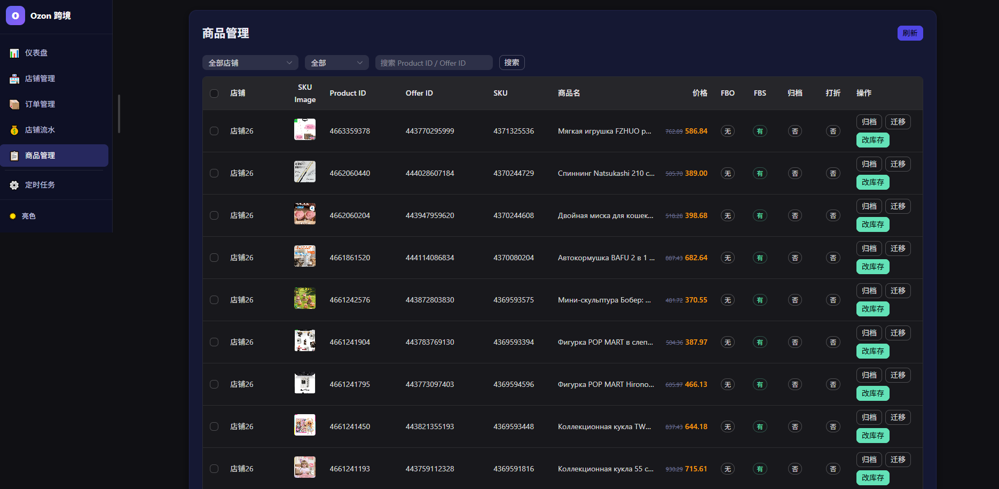
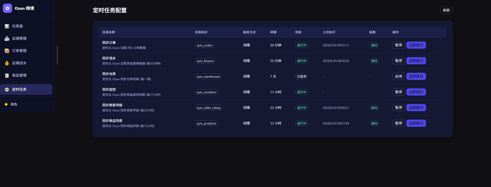

<div align="center">

# 鲸智 AI

### 跨境电商智能管理系统

一站式解决多平台卖家的店铺管理、商品采集、选品分析与数据监控需求。


### 🚀 规划中

> **AI 智能处理** · **精铺刊登** · **浏览器指纹管理** · **多账号防关联** · **智能定价** · **竞品监控** · **数据分析报表**
>
> 持续迭代中，敬请期待。

</div>

---

## 功能亮点

### 数据驾驶舱

实时总览所有店铺的核心经营指标，严格区分**质检单**与**真实订单**，拒绝虚增数据。

|  总 GMV  | 质检单 GMV | 真实 GMV | 总订单数 |
| :------: | :--------: | :------: | :------: |
| 14.45 万 |  12.23 万  | 2.21 万  | 2228 单  |



- **质检单智能识别** — 自动识别 0213 / 0209 / 0247 / 0231 等前缀的非真实订单，GMV 统计自动剔除
- **多店铺汇总** — 支持按店铺筛选，按币种 (RUB / KZT) 分组展示，避免混合币种虚增总额

---

### 店铺管理

统一管理所有 Ozon 店铺的 API 凭证与运营配置。



- 一键添加店铺，填入 `Client-Id` + `Api-Key` 即可接入
- 自动拉取并展示**卖家评级**（订单缺陷率、取消率等核心评分）
- 支持设置仓库、VAT 税率、自动广告 / 归档 / 删除等运营开关

---

### 订单管理

全量订单列表，支持多维度检索与状态追踪。



- **13 种订单状态**实时同步 — 从待出库到仲裁，全流程覆盖
- 按店铺 / 状态 / 订单号 / SKU / 商品名多维筛选
- 订单卡片含商品图片、实付款、佣金、发货时限等关键信息
- 支持导出 Excel 对账

---

### 店铺资金流水

自动抓取 Ozon 财务报告，按店铺 / 币种清晰展示资金明细。



- **余额概览** — 总可用余额、收入、佣金、支出、待结算、已打款，按币种分组
- **财务报告** — 按期间展示销售额、退货、佣金、物流费、仓储费等明细
- **收入 / 支出明细** — 费用项精确到每一位小数，支持展开查看服务费构成

---

### 商品管理

与 Ozon 平台实时同步商品数据，批量操作提升效率。



- 同步 FBS / FBO 库存状态，实时掌握各 SKU 可售数量
- 批量**归档**商品（限 FBS 库存为 0 且无在途订单）
- 商品主图、SKU、定价、折扣价一目了然

---

### 定时任务

可视化管理所有数据同步任务，灵活配置执行周期。



- **8 项同步任务**：订单、财务、库存、商品、评级、监控、仓库、定价表
- Cron 表达式自由调度，支持立即执行
- 运行记录实时反馈 — 状态、耗时、上次执行时间

---

## 系统架构

```
┌────────────────────────────────────────────────────────┐
│                    Frontend (Vue 3)                     │
│         Dashboard · Stores · Orders · Finance · Tasks   │
└───────────────────────────┬────────────────────────────┘
                            │ HTTP REST
┌───────────────────────────▼────────────────────────────┐
│                   Backend (FastAPI)                     │
│                                                        │
│  ┌─────────┐  ┌──────────────┐  ┌──────────────────┐  │
│  │ Routers │  │  Scheduler   │  │   OzonClient     │  │
│  │  (API)  │  │(APScheduler) │  │  (API Gateway)   │  │
│  └────┬────┘  └──────┬───────┘  └────────┬─────────┘  │
│       │              │                   │             │
│  ┌────▼──────────────▼───────────────────▼──────────┐  │
│  │               Service Layer                       │  │
│  │    sync_orders · sync_finance · sync_products     │  │
│  └───────────────┬──────────────────────────────────┘  │
│                  │                                     │
│  ┌───────────────▼──────────────────────────────────┐  │
│  │          SQLite + SQLAlchemy ORM                  │  │
│  └──────────────────────────────────────────────────┘  │
└────────────────────────────────────────────────────────┘
                            │
                 ┌──────────▼──────────┐
                 │   Ozon Seller API   │
                 │  api-seller.ozon.ru │
                 └─────────────────────┘
```

### 技术选型

| 层     | 技术                     | 说明                               |
| ------ | ------------------------ | ---------------------------------- |
| 前端   | Vue 3 + Naive UI + Pinia | 响应式管理面板，暗色主题           |
| 后端   | FastAPI + SQLAlchemy 2.0 | 高性能异步 API，ORM 数据操作       |
| 数据库 | SQLite                   | 零配置，单文件部署                 |
| 调度   | APScheduler              | 支持 Cron 表达式，任务状态持久化   |
| API    | Ozon Seller API          | 覆盖订单/财务/商品/评级/仓库全接口 |

---

## 快速开始

### 1. 后端

```bash
cd backend
pip install -r requirements.txt
uvicorn app.main:app --reload --host 0.0.0.0 --port 9000
```

### 2. 前端

```bash
cd frontend
npm install
npm run dev
```

### 3. 访问

浏览器打开 `http://localhost:5173`，在「店铺管理」中添加 Ozon 店铺的 `Client-Id` 和 `Api-Key`，系统即开始工作。

### 4. powerpaint

# 1. 安装依赖
cd backend && pip install torch diffusers huggingface_hub transformers accelerate Pillow

# 2. 下载模型（~4GB）
python scripts/download_powerpaint_models.py

# 3. 启动后端（自动检测 CPU/GPU）
uvicorn app.main:app --reload

---

## 项目结构

```
auto-ozon/
├── backend/
│   ├── app/
│   │   ├── api/routers/       # API 路由（仪表盘/店铺/订单/财务/任务）
│   │   ├── core/              # 配置、数据库连接
│   │   ├── crud/              # 数据库增删改查
│   │   ├── models/            # SQLAlchemy 数据模型
│   │   ├── schemas/           # Pydantic 数据验证
│   │   └── services/          # 业务逻辑（Ozon 通信/同步调度）
│   └── tests/                 # 单元测试
├── frontend/
│   └── src/
│       ├── views/             # 页面组件
│       ├── components/        # 通用组件
│       ├── api/               # 接口封装
│       ├── router/            # 路由配置
│       └── store/             # 状态管理
├── docs/                      # 产品文档 & API 参考
└── assets/                    # 项目截图
```

---

<div align="center">

## 联系作者

如有合作意向、技术咨询或定制开发需求，欢迎通过微信联系：

|           个人微信           |              微信收款码              |         支付宝收款码         |
| :--------------------------: | :----------------------------------: | :--------------------------: |
|  |  |  |

---

**鲸智 AI** © 2024 · MIT License

</div>
