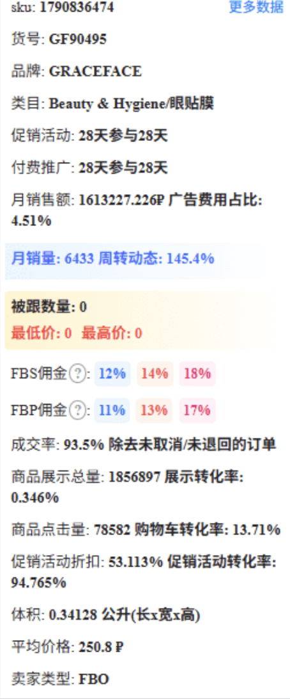

# 采集强制要求

。

1. SKU
2. 货号
3. 品牌
4. 类目
5. 促销活动
6. 付费推广
7. 月销售额
8. 月销量
9. 周转动态
10. 被跟数量
11. 最低价
12. 最高价
13. rFBS佣金
14. FBP佣金
15. 成交率
16. 体积
17. 长 宽 高(不是 SKU 的规格，是物流包装的规格)
18. 重量(不是 SKU 的重量，是物流包装的重量)
19. 上架时间
20. 成交率

## 指标含义与官网可采集性确认

以下结论基于 Ozon 买家端公开商品页、商品页内部 JSON/XHR、商品属性（Characteristics）与物流 Widget 的可见数据边界。买家端能采集到的字段必须以页面 JSON/DOM 明确出现为准；卖家经营指标、佣金、转化类指标不应从标题、类目或相似文案猜测。

| 指标 | 含义 | Ozon 买家端处理结论 |
|---|---|---|
| SKU | Ozon 商品 ID 或页面明确给出的 SKU 标识，用于定位商品 | 可以采集。优先取 `skuList.sku` / `SKU` / `Ozon SKU`，否则用 URL 中商品 ID 兜底 |
| 货号 | 卖家货号 / vendor code / `Артикул продавца`，不是 Ozon URL ID | 条件采集。只有属性或 SKU 区域出现 `Артикул` / `vendor code` 时可正确采集；公开页缺失时不能推断 |
| 品牌 | 商品品牌 | 可以采集。优先取 `webBrand`、品牌链接、JSON-LD、属性 `Бренд` |
| 类目 | 商品所在 Ozon 类目路径 | 可以采集。只取面包屑 / breadcrumb JSON，不从推荐区或任意 category 字段猜测 |
| 促销活动 | 买家端可见的折扣、优惠券、促销标签 | 条件采集。页面显示促销标签或折扣时可采集；后台活动配置不可从公开页完整获取 |
| 付费推广 | 商品是否为广告位/赞助展示 | 条件采集。列表或页面出现 `реклама` / `sponsored` 时可识别；无法判断卖家后台是否投放中 |
| 月销售额 | 最近一个月成交金额 | 公开买家端无法可靠采集。只能由卖家 API、数据分析接口或第三方选品数据提供 |
| 月销量 | 最近一个月成交件数 | 公开买家端无法可靠采集。若页面/API 明确返回 monthly sales 才可采集，否则不可用评价数代替 |
| 周转动态 | 库存周转或销售趋势变化 | 公开买家端无法可靠采集。属于经营分析指标，需要卖家/分析 API |
| 被跟数量 | 被收藏、关注、跟卖或跟踪数量，需按业务口径确认 | 公开买家端无法可靠采集。页面一般不暴露商品关注数；如果指“跟卖数量”，需要报价/卖家接口 |
| 最低价 | 当前可见价格集合中的最低售价 | 可以采集。取当前价、划线价、变体/阶梯价格中的有效最小值；没有变体价格时等于当前价 |
| 最高价 | 当前可见价格集合中的最高售价 | 可以采集。取当前价、划线价、变体/阶梯价格中的有效最大值 |
| rFBS佣金 | Ozon rFBS 模式佣金/费率 | 公开买家端无法采集。需要 Ozon Seller API、费率表或商家后台数据 |
| FBP佣金 | 文档中的 FBP 应按 FBO/FBP 费率口径确认，属于平台佣金 | 公开买家端无法采集。需要 Seller API、费率表或商家后台数据 |
| 成交率 | 曝光/访问到成交的转化率 | 公开买家端无法采集。需要卖家数据、广告/分析 API；列表页评价和销量不能反推成交率 |
| 体积 | 物流包装体积，通常由包装长 × 包装宽 × 包装高计算，单位 cm³ | 条件采集。只有明确命中包装尺寸字段时计算；不能用 SKU 商品尺寸冒充包装体积 |
| 长 宽 高 | 物流包装长宽高，不是颜色/尺码等 SKU 规格 | 条件采集。只从 `Размер упаковки`、`габариты упаковки`、`package size/dimension` 等包装字段输出 |
| 重量 | 物流包装重量，不是商品净重或 SKU 重量 | 条件采集。只从 `Вес с упаковкой`、`package weight`、`shipping weight` 等包装字段输出 |
| 上架时间 | 商品创建/发布/上架日期 | 公开买家端通常无法可靠采集。只有 JSON/API 明确返回 created/listed/published 时间时可采集 |
| 成交率 | 同第 15 项，文档重复项 | 同第 15 项 |

强制规则：第 16-18 项必须采集物流包装口径。若页面只有 `Вес товара`、`Вес`、`Длина`、`Ширина`、`Высота` 等商品本体规格，只能保存到商品规格字段，`package_weight` / `package_length` / `package_width` / `package_height` 必须留空并进入缺失字段。


# Ozon 官网物流、重量与尺寸采集方案

## 目标

采集 Ozon 官网公开商品信息，重点获取：

-   SKU
-   标题
-   重量
-   包装重量
-   长、宽、高
-   配送方式
-   仓库
-   配送区域
-   配送时效

------------------------------------------------------------------------

# 方案一：采集商品详情页 JSON

Ozon 使用 React SPA，HTML 仅包含页面骨架。

真正的数据通常来自：

-   window.\_\_INITIAL_STATE\_\_
-   内嵌 JSON
-   GraphQL
-   Apollo Cache

建议优先解析 JSON，而不是 HTML。

------------------------------------------------------------------------

# 方案二：分析 Network 请求

浏览器：

F12 → Network → Fetch/XHR

重点关注：

-   graphql
-   product
-   widget
-   layout
-   state

这些请求通常返回：

-   商品基本信息
-   配送信息
-   Seller 信息
-   商品属性（Characteristics）

------------------------------------------------------------------------

# 方案三：采集物流信息

物流 Widget 通常包含：

-   warehouse
-   delivery method
-   delivery days
-   availability

示例：

``` json
{
  "delivery": {
    "warehouse": "Москва",
    "method": "Courier",
    "days": 2
  }
}
```

可采集：

-   warehouse_name
-   delivery_method
-   delivery_days

------------------------------------------------------------------------

# 方案四：采集重量与尺寸

重点解析商品属性（Characteristics）。

常见俄文字段：

  俄文              中文
  ----------------- ----------
  Вес               重量
  Вес товара        商品重量
  Вес с упаковкой   包装重量
  Высота            高
  Ширина            宽
  Длина             长
  Размер упаковки   包装尺寸
  Объем             体积

统一转换为标准字段：

-   weight
-   package_weight
-   length
-   width
-   height
-   package_length
-   package_width
-   package_height

------------------------------------------------------------------------

# 方案五：物流模式判断

买家端通常不会直接显示：

-   FBO
-   FBS
-   realFBS

可依据页面文案推断：

  页面文案             推测
  -------------------- ---------
  Delivery by Ozon     FBO
  Delivery by Seller   FBS
  Partner Delivery     realFBS

如有 Seller API，应以 API 返回结果为准。

------------------------------------------------------------------------

# 推荐数据模型

``` text
Product
│
├── product_id
├── sku
├── title
├── brand
├── seller
├── seller_id
├── warehouse
├── warehouse_id
├── logistics_type
├── delivery_method
├── delivery_days
├── weight
├── package_weight
├── length
├── width
├── height
├── package_length
├── package_width
├── package_height
├── attributes[]
└── images[]
```

------------------------------------------------------------------------

# 企业级采集架构

``` text
Ozon 商品 URL
        │
 ┌──────┴────────┐
 │               │
HTML         GraphQL/XHR
 │               │
 └──────┬────────┘
        │
 JSON 解析引擎
        │
 ┌──────┼──────────┐
 │      │          │
基础信息 属性解析 物流解析
        │
 数据标准化
        │
MySQL/PostgreSQL
        │
AI 翻译 + AI 补全 + 自动刊登
```

## 建议

-   GraphQL/XHR 为主，HTML 为辅。
-   建立统一字段映射。
-   物流规则与重量尺寸校验模块独立封装。
-   缺失重量可结合 AI 与类目规则估算。
